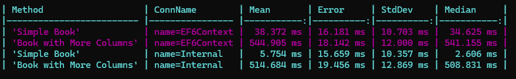
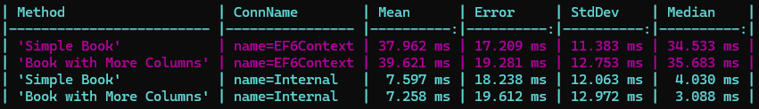

# SimpleSqlTest

1. **Setup Test Database**
   Either use docker desktop and the docker-compose file to setup the sql container or setup sql server manually and use the init.sql file in the DockerSqlSetup/init folder.

1. **Configure Connection Strings**  
   Edit the `SimpleSqlTest.exe.config` file to include the connection string for the benchmark database you intend to test.

2. **Run the Test**
   Execute `SimpleSqlTest.exe` from the command line with the name of the connection string you want to test. (e.g., .\SimpleSqlTest.exe SurfaceGo4)


   
# EFBenchmarker

**EFBenchmarker** is a tool designed to evaluate network card performance with Entity Framework by running simple benchmarks on different contexts. 

## Usage Instructions

1. **Configure Connection Strings**  
   Edit the `EFBenchmark.exe.config` file to include the connection strings for the databases connections you want to benchmark.

2. **Run the Benchmark**  
   Execute `EFBenchmark.exe` from the command line with the name of the connection string(s) you want to test.

   - If no arguments are provided, the tool defaults to using `EF6Context`.

   - Example:
     ```bash
     EFBenchmark.exe EF6Context Internal
     ```

3. **Tests Performed**  
   For each connection string, the following tests are performed 10 times each:
   - **Simple Book:** Retrieves a list of `Books` from the database.
   - **Book with More Columns:** Retrieves similar data, but with additional extended (empty) columns. 

4. **Performance Note**  
   On newer Surface devices such as Surface Go 4+ and Surface Pro 10+, when using onboard Wi-Fi, the `Books with More Columns` test introduces a ~0.5-second delay.
---

## Example Output

**Surface Pro 10 for Business (Onboard Wifi)**


**Surface Pro 10 for Business (External Wifi)**

